<div align="center">

# 🚨 Deadlock Escape Game

### *An interactive, gamified OS deadlock simulator — beat the Banker's Algorithm, not a test.*

[](https://openjdk.org/projects/jdk/25/)
[](https://openjfx.io/)
[](https://www.mysql.com/)
[](https://maven.apache.org/)
[](https://github.com/aliyaahmad948/OS-DEADLOCK-ESCAPE)
[](LICENSE)

<br>

**Resolve process-resource dependency graphs without triggering a deadlock — across 25 structurally escalating levels.**

</div>

---

## Hero

<p align="center">
  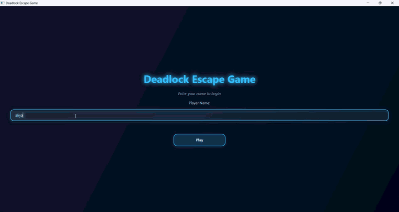
</p>

> *Drop your gameplay demo GIF (or a hero screenshot) at `docs/screenshots/demo.gif` — this is the single most important visual on the page.*

---

## Table of Contents

- [About The Project](#about-the-project)
- [Features](#features)
- [Screenshots & Demo](#screenshots--demo)
- [Tech Stack](#tech-stack)
- [Architecture Overview](#architecture-overview)
- [Educational Value](#educational-value)
- [Getting Started](#getting-started)
- [How to Play](#how-to-play)
- [Project Structure](#project-structure)
- [Roadmap](#roadmap)
- [Contributing](#contributing)
- [License](#license)
- [Author & Contact](#author--contact)

---

## About The Project

**Deadlock** is one of the hardest Operating Systems concepts to *see* — processes quietly waiting on each other in a circle while nothing ever finishes. Textbooks describe it with static diagrams; this game lets you **live it**.

**Deadlock Escape Game** is a JavaFX-based educational simulator where you manage a live Resource Allocation Graph (RAG) with the mouse: click a process node, click a resource node, and allocate. Every level is a solvable graph, and every careless request is an opportunity to learn — the game highlights the cycle the moment your move would close it.

It is built for **students, self-learners, and instructors** who want deadlock prevention, the Coffman conditions, and the **Banker's Algorithm** to *click* — literally.

What makes it more than a pretty visualization:

- 🎓 **Real Banker's Algorithm integration** — in the final mode, requests are vetted for safety before they're granted, and safe requests pay a 🥇 **GOLD** bonus.
- 🧩 **Structural difficulty scaling** — later levels don't just add nodes; they use genuinely different dependency shapes (contested hubs, multi-hold webs, converging chains, open rings).
- 🛟 **Recovery Advisor** — when things go wrong, it recommends the cheapest preemption to break the cycle.
- 🏆 **Full progression system** — XP, 3-star ratings, level locking/unlocking, 6 achievements, and MySQL-persisted profiles.

---

## Features

### 🎮 Gameplay
- **Click-to-select nodes** on the graph — no dropdowns. Selected nodes glow cyan; your current process/resource selection is shown live.
- **Allocate / Release / Finish** — grant resources, free them, complete processes; auto-finish when a process holds nothing.
- **Detect Deadlock** — run a DFS cycle check on demand with a red cycle overlay.
- **Banker's Algorithm mode** — safe requests granted 🥇 (+25 GOLD), unsafe requests rejected with an explanation.
- **Hint, Restart, and Exit-with-confirmation** (exit never counts as a loss).

### 🎓 Educational
- **Mission banner** per level + a **concept badge** (Mutual Exclusion, Hold & Wait, No Preemption, Circular Wait).
- **OS Guide panel** — context-aware tips that appear when you're about to make a risky move.
- **"Why It Matters"** — a real-world OS explanation on every level complete.
- **Visual cycle breakdown on failure** — the arrow chain of the deadlock plus "what is happening" bullets.
- **Recovery Advisor** — the cheapest single resource to preempt, computed from the actual graph.

### 🏆 Progression
- **XP + 3-star ratings + efficiency %** per level; stars unlock the next level in each mode.
- **6 achievements**: Deadlock Hunter, System Guardian, Banker, Recovery Expert, Speed Runner, OS Master.
- **Concept mastery** — master all 5 levels of a mode to "master" that concept (visible as a bar chart on your profile).

### 🛠️ Technical
- **Programmatic JavaFX UI** (zero FXML) with a custom animated node-graph canvas.
- **Navy + Neon dark theme** with a one-click **light theme** toggle (persisted between runs).
- **MySQL persistence** for scores, per-mode leaderboards, and player progress (stars, unlocks, best scores).
- **Verified solvability** — all 25 levels pass a Banker's-safety check (`findSafeSequence()` non-empty, no startup deadlock).

---

## Screenshots & Demo

> *Full gameplay demo — see the GIF at the top of the page.*
> *Every image below is a placeholder — drop your screenshots into `docs/screenshots/` with these exact file names and they'll render automatically.*

### Onboarding & Menu

<p align="center">
  <table>
    <tr>
      <td>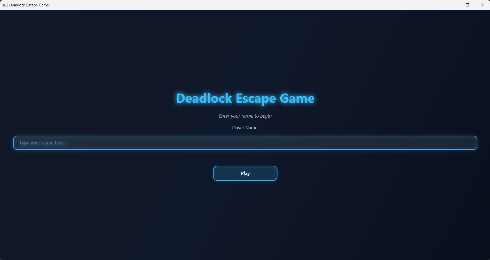</td>
      <td>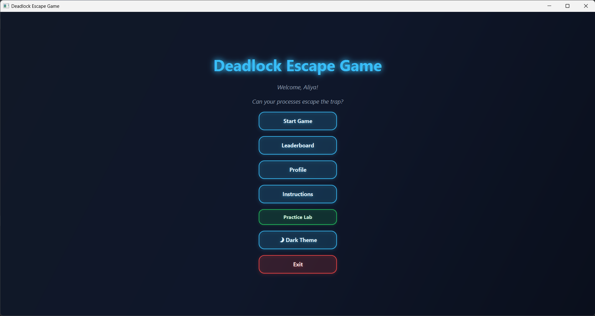</td>
      <td>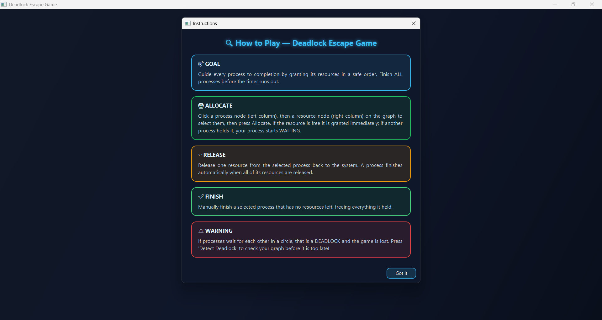</td>
    </tr>
    <tr>
      <td><em>Enter your name to load your saved progress.</em></td>
      <td><em>Every entry point, plus the dark/light theme toggle.</em></td>
      <td><em>Colour-coded rule cards for each core action.</em></td>
    </tr>
  </table>
</p>

### Mode & Level Selection

<p align="center">
  <table>
    <tr>
      <td>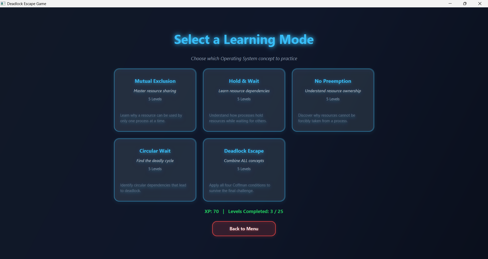</td>
      <td>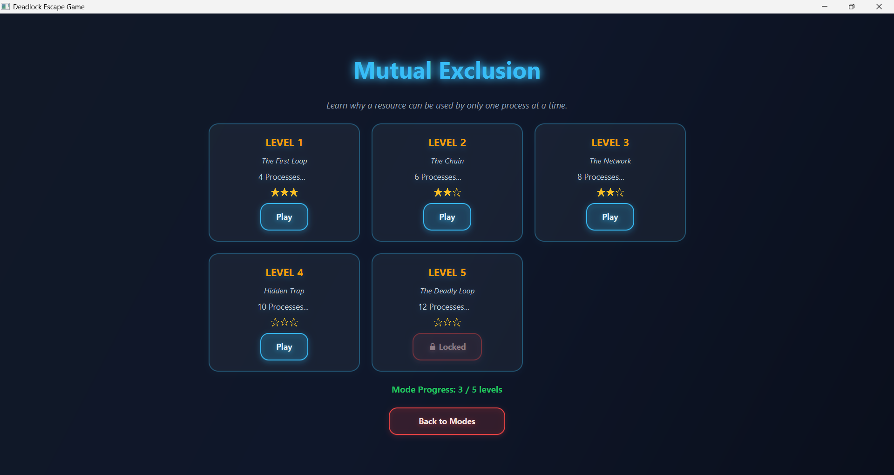</td>
    </tr>
    <tr>
      <td><em>Choose which of the 4 Coffman conditions to practice.</em></td>
      <td><em>Star ratings and 🔒 locked states per level.</em></td>
    </tr>
  </table>
</p>

### Core Gameplay

<p align="center">
  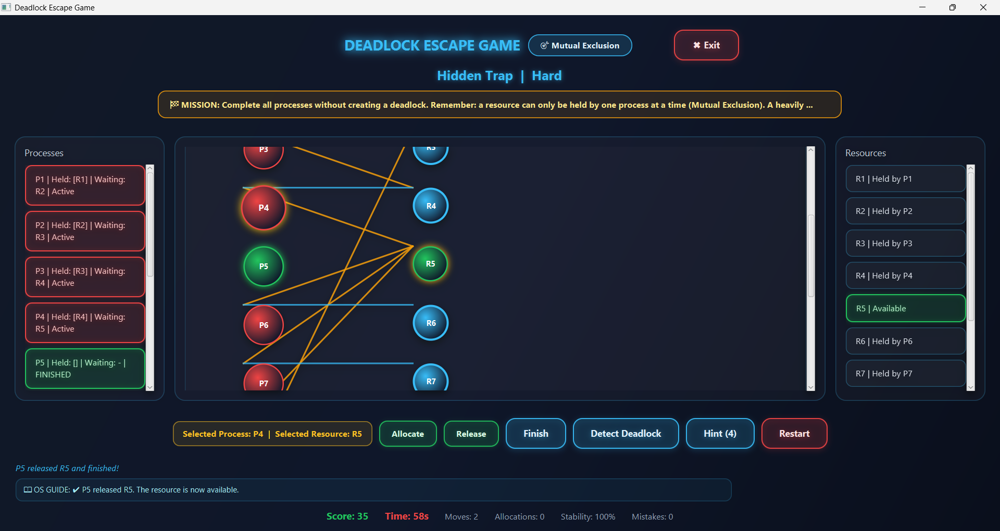
  <em>Players click directly on process and resource nodes to select them — the selected pair glows.</em>
</p>

### Deadlock Detection & Recovery

<p align="center">
  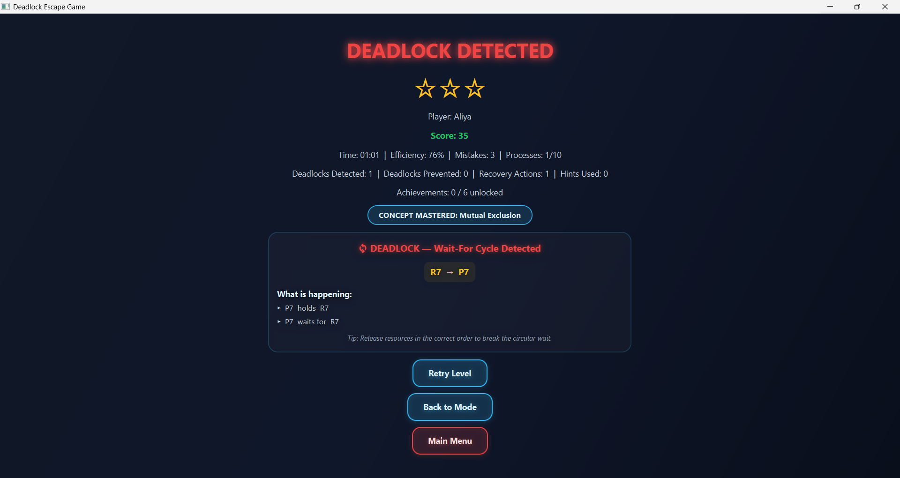
  <em>The red cycle chain with its "what is happening" breakdown — and the Recovery Advisor's suggested preemption.</em>
</p>

### Winning & Progression

<p align="center">
  <table>
    <tr>
      <td>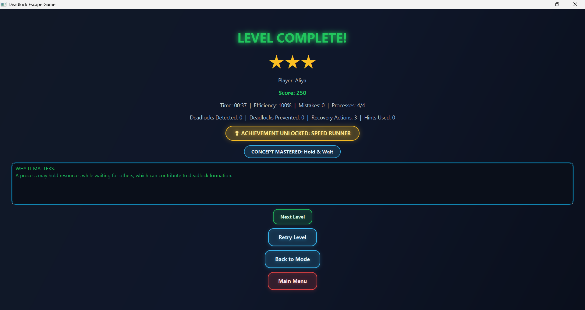</td>
      <td>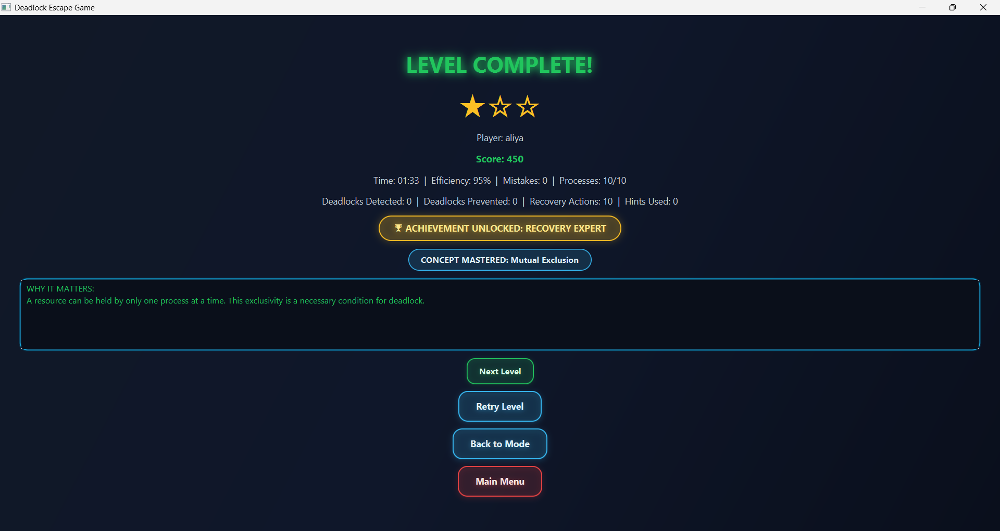</td>
    </tr>
    <tr>
      <td><em>Stars, efficiency, and the "Why It Matters" OS lesson.</em></td>
      <td><em>🥇 GOLD bonus moment when a safe request is granted in Banker's mode.</em></td>
    </tr>
  </table>
</p>

### Leaderboard & Profile

<p align="center">
  <table>
    <tr>
      <td>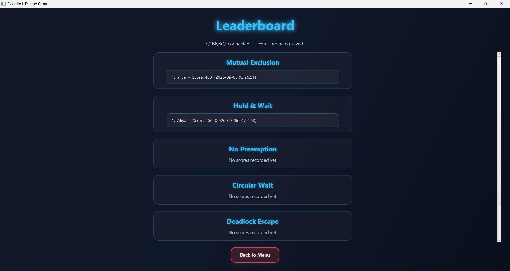</td>
      <td>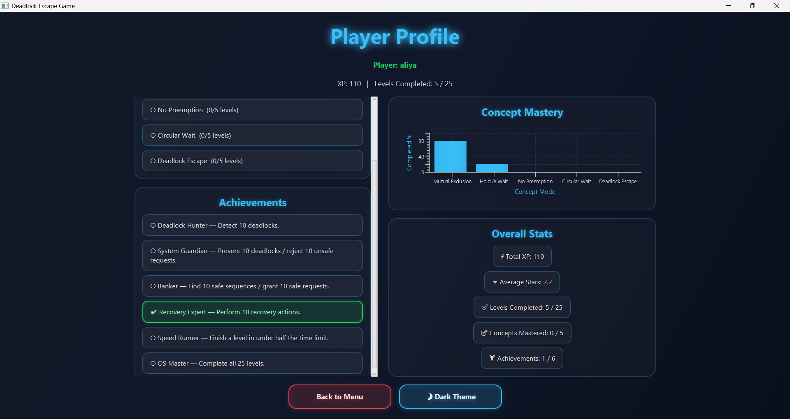</td>
    </tr>
    <tr>
      <td><em>Per-mode leaderboards plus overall top scores.</em></td>
      <td><em>Concept mastery bar chart, achievements, and overall stats.</em></td>
    </tr>
  </table>
</p>

### Practice Lab

<p align="center">
  <table>
    <tr>
      <td>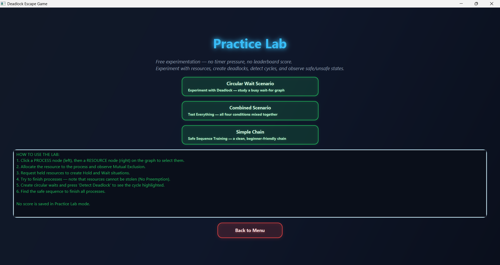</td>
      <td>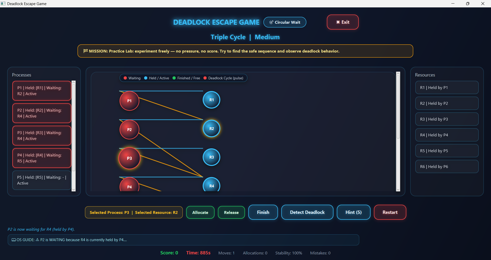</td>
    </tr>
    <tr>
      <td><em>Choose a scenario to experiment with.</em></td>
      <td><em>A risk-free sandbox — no timer, no score, no loss.</em></td>
    </tr>
  </table>
</p>

---

## Tech Stack

| Technology | Purpose |
|-----------|---------|
| **Java 25** | Core language — all game logic, models, and UI layer |
| **JavaFX 21** | GUI rendering — programmatic scenes, custom animated `GraphCanvas`, real-time node graphs |
| **MySQL 8** | Persistent storage for player scores, leaderboards, and level progress |
| **MySQL Connector/J 8.3** | JDBC driver for database connectivity |
| **Maven** | Build and dependency management |

---

## Architecture Overview

The app is a set of **standalone scene builders** (`ui/*Screen.java`), each returning a `Scene` and wired together through a shared `Stage`. Non-UI logic lives in `logic/`, models in `model/`, persistence in `db/`.

```text
application/Main.java  (entry point — fullscreen stage + scene listener)
        │
        ▼
 LoginScreen ─────────────────────────────────────────► MenuScreen
 (name entry)                                               │
    ┌───────────────────────┬──────────────────────────────┤
    ▼                       ▼                              ▼
 ModeSelection        LeaderboardScreen            PracticeLabScreen
 (5 modes)            (per-mode + overall)          (sandbox, no timer)
    │                       ▲
    ▼                       │
 ConceptModeLevelScreen     │
 (5 levels, lock/star)      │
    │                       │
    ▼                       │
 GameScreen ──► ResultScreen ──► Back to Mode / Retry / Next Level
 (node-graph                  │
  gameplay)                   └──► MySQL ScoreDatabase (save score, mode score, progress)
        ▲
        └── ProfileScreen (mastery chart, achievements, stats)
```

**Cross-cutting logic:** `GameManager` (state + Banker's safety), `LevelFactory` (25 levels), `DeadlockDetector`, `RecoveryAdvisor`, `ProgressManager` (session + MySQL-backed progress), `AchievementTracker`.

---

## Educational Value

Each game mode is built around **one condition of the Coffman deadlock requirements** — and the final mode combines all four.

| Mode | OS Concept Taught | What The Player Experiences |
|------|-------------------|------------------------------|
| **Mutual Exclusion** | A resource can be held by only one process at a time | Several processes fighting over one held resource — who should get it first? |
| **Hold & Wait** | A process may hold resources while waiting for more | Dual-holder processes whose release order decides everything |
| **No Preemption** | Resources can't be forcibly taken from a busy process | Chains converging on a guarded resource — no force, only ordering |
| **Circular Wait** | A cycle of "A waits for B, B waits for C, C waits for A" | Open rings that the wrong request snaps shut into a deadlock |
| **Deadlock Escape** | All four conditions *combined* — plus the Banker's Algorithm | Multi-shape chaos graphs where safe requests literally pay 🥇 |

### The 4 Coffman Conditions (informally)

| Condition | Plain English |
|-----------|---------------|
| **Mutual Exclusion** | A resource has exactly one owner at a time. |
| **Hold & Wait** | A process keeps what it has while asking for more. |
| **No Preemption** | You can't snatch a resource from a busy process. |
| **Circular Wait** | Every process in a loop is waiting on the next one. |

All four together ⇒ deadlock. The game's `DeadlockDetector` (DFS cycle detection) shows the circle the moment it forms.

### Banker's Algorithm

In **Deadlock Escape levels 4–5**, every allocation request is intercepted and checked the way Dijkstra's Banker would check it: *would granting this request leave the system in a state where every process can still finish?*

- ✅ **Safe request** → granted, with a 🥇 **GOLD +25** bonus.
- ❌ **Unsafe request** → rejected with an explanation of why it would deadlock, using the current safe sequence.

---

## Getting Started

### Prerequisites

- **Java JDK 25+**
- **MySQL 8.0+** (running on `localhost:3306`)
- **Maven 3.9+**

### 1. Clone the repository

```bash
git clone https://github.com/aliyaahmad948/OS-DEADLOCK-ESCAPE.git
cd OS-DEADLOCK-ESCAPE
```

### 2. Set up MySQL

Create the database. Tables (`scores`, `scores_mode`, `level_progress`) are **auto-created on first launch** by `db/ScoreDatabase` — no schema script to run.

```sql
CREATE DATABASE deadlock_game;
```

### 3. Configure credentials

Edit `src/main/java/db/ScoreDatabase.java`:

```java
private static final String DB_USER = "root";
private static final String DB_PASS = "your_password";
```

> Login is a lightweight name entry (no account system) — scores and progress are keyed by the name you enter.

### 4. Build

```bash
mvn clean package
```

Working offline? Use: `mvn -o compile`

### 5. Run

```bash
mvn javafx:run
```

Or open **IntelliJ IDEA** → run `application/Main.java`.

---

## How to Play

| Action | What to do |
|--------|-----------|
| 🎯 **Goal** | Finish **all** processes in a safe order before the timer ends. |
| 📥 **Allocate** | Click a *process* node → click a *resource* node → **Allocate**. Free resource = granted (+10); held resource = your process starts **waiting**. |
| ↪ **Release** | Select process + resource → **Release**. A process finishes automatically when it holds nothing (+25). |
| ✅ **Finish** | Select a process with no held resources → **Finish** it manually. |
| ⚠️ **Warning** | If processes wait on each other in a circle, that's a **deadlock** — you lose the level. Use **Detect Deadlock** to check before it's too late. |
| 🚪 **Exit** | Exit confirms first and never counts as a loss. |

---

## Project Structure

```text
Deadlock-Escape-Game/
├── src/main/java/
│   ├── application/
│   │   └── Main.java                    # Entry point — fullscreen stage handling
│   ├── model/
│   │   ├── Achievement.java             # Achievement definition
│   │   ├── Difficulty.java              # Easy → Medium → Hard → Expert → Chaos
│   │   ├── GameMode.java                # The 5 playable modes
│   │   ├── Level.java                   # Level data (names, allocations, requests)
│   │   ├── LevelResult.java             # Simulation outcome summary
│   │   ├── Mission.java                 # Mission + bonus objectives
│   │   ├── Process.java                 # Process state + request handling
│   │   ├── Resource.java                # Resource state + allocation
│   │   └── PlayerSession.java           # Current player singleton
│   ├── logic/
│   │   ├── GameManager.java             # Core logic, scoring, Banker's safety check
│   │   ├── LevelFactory.java            # Generates all 25 levels (structural scaling)
│   │   ├── DeadlockDetector.java        # DFS cycle detection
│   │   ├── RecoveryAdvisor.java         # Cheapest-preemption suggestions
│   │   ├── ProgressManager.java         # Session + MySQL-backed progression
│   │   ├── AchievementTracker.java      # 6-achievement unlock engine
│   │   ├── StarsCalculator.java         # 3-star ratings + efficiency %
│   │   ├── HintManager.java             # Context-aware hazard hints
│   │   └── OSGuide.java                 # Educational OS guidance panel
│   ├── ui/
│   │   ├── LoginScreen.java             # Name entry
│   │   ├── MenuScreen.java              # Main menu + Instructions dialog
│   │   ├── ModeSelectionScreen.java     # Choose a mode
│   │   ├── ConceptModeLevelScreen.java  # Level select (lock / star states)
│   │   ├── GameScreen.java              # Core gameplay — node-graph canvas
│   │   ├── ResultScreen.java            # Win / Deadlock-detected screens + DB save
│   │   ├── LeaderboardScreen.java       # Per-mode + overall leaderboards
│   │   ├── ProfileScreen.java           # Mastery chart, achievements, stats
│   │   ├── PracticeLabScreen.java       # Free-play sandbox
│   │   ├── ThemeManager.java            # Dark ↔ light theme switching
│   │   └── graph/
│   │       ├── GraphCanvas.java         # RAG visualization + click-hit-testing
│   │       ├── NodeView.java            # Animated process/resource nodes
│   │       └── ConnectionLine.java      # Animated request edges
│   └── db/
│       └── ScoreDatabase.java           # MySQL CRUD for scores + progress
├── src/main/resources/
│   ├── style.css                        # Navy + Neon dark theme
│   └── style-light.css                  # Light theme variant
├── docs/screenshots/                    # Screenshots (drop images here)
└── pom.xml                              # Maven build configuration
```

---

## Roadmap

Planned improvements and ideas for the future:

- **More level shapes per mode** — randomized-but-verified graph generation so each playthrough feels fresh while staying solvable.
- **Multiplayer race mode** — compete with a friend on the same graph; first safe completion wins.
- **Exportable progress report** — generate a PDF/CSV of your stars, achievements, and mastery by concept (handy for instructors).
- **Sound design & ambient feedback** — allocation/deadlock alerts with a toggle.
- **Web/desktop packaging** — jlink images and mobile-friendly layouts for classroom setups.

---

## Contributing

Contributions are welcome and appreciated. Here's how to help:

1. **Fork** the repository.
2. Create your feature branch: `git checkout -b feature/your-idea`
3. Commit your changes: `git commit -m 'Add your-idea'`
4. Push: `git push origin feature/your-idea`
5. Open a **Pull Request** — keep changes focused and the game compilable.

For bug reports or feature requests, open an issue with a clear description and, ideally, a screenshot of the problem.

---

## License

Distributed under the **MIT License**. See [`LICENSE`](LICENSE) for more information.

---

## Author & Contact

**Alia Ahmad**
- GitHub: [@aliyaahmad948](https://github.com/aliyaahmad948)
- LinkedIn: [Your LinkedIn URL]
- Email: [Your Email Address]

---

<p align="center">
  <b>Built with ☕, JavaFX, and a deep respect for the Banker's Algorithm.</b><br>
  <i>If this project helped you understand OS deadlocks, consider giving it a ⭐.</i>
</p>